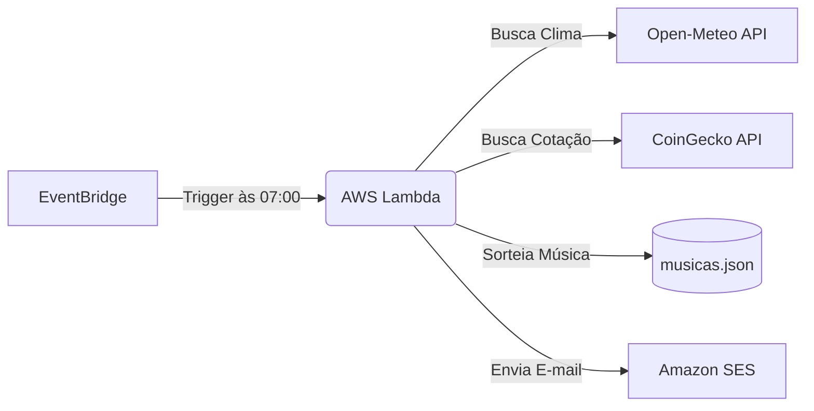

<h1 align="center">
  ☀️ Resumo Matinal AWS
</h1>

<p align="center">
  
  
  
  
</p>

<p align="center">
  Um bot Serverless rodando na AWS que entrega um resumo diário direto na sua caixa de entrada!
</p>

---

## 🎯 O que o bot faz?

Todo dia, pontualmente às 07:00 da manhã, este bot envia um e-mail contendo:
- 🌡️ **Clima em tempo real** do Rio de Janeiro
- ₿ **Cotação atual do Bitcoin** (em Dólar e Real)
- 🎸 **Recomendação aleatória de uma música Rock** (de uma base de mais de 260 clássicos!)

## 🏗️ Arquitetura do Projeto

O projeto foi construído utilizando o conceito **Serverless** na nuvem da AWS, garantindo custo zero e alta confiabilidade.



## 📧 Exemplo de E-mail

```text

Bom dia, Vamos para mais um dia!


Clima no Rio de Janeiro: 25.3°C
Bitcoin: US$ 76,149.00 | R$ 392,349.00
Música do dia: War Pigs - Black Sabbath

```

## 🚀 Tecnologias Utilizadas

- **Linguagem:** Python 3.12
- **Bibliotecas:** `requests` (consumo de APIs) e `boto3` (SDK da AWS)
- **AWS Lambda:** Execução do código sem necessidade de gerenciar servidores.
- **Amazon EventBridge:** Agendamento cron (`cron(0 10 * * ? *)`) para disparar o Lambda.
- **Amazon SES:** Serviço de disparo de e-mails de forma segura.


## 👨‍💻 Como rodar na sua máquina

Para testar o script localmente antes de subir para a nuvem:

```bash
# Clone este repositório
$ git clone https://github.com/pedroagrelli/projetopy-aws.git

# Entre na pasta
$ cd projetopy-aws

# Crie e ative um ambiente virtual (venv)
$ python3 -m venv venv
$ source venv/bin/activate

# Instale as dependências
$ pip install -r requirements.txt

# Configure suas credenciais da AWS (requer AWS CLI)
$ aws configure

# Rode o script!
$ python app.py
```
 

---
Desenvolvido como projeto de estudo prático por [Pedro Agrelli](https://github.com/pedroagrelli).
